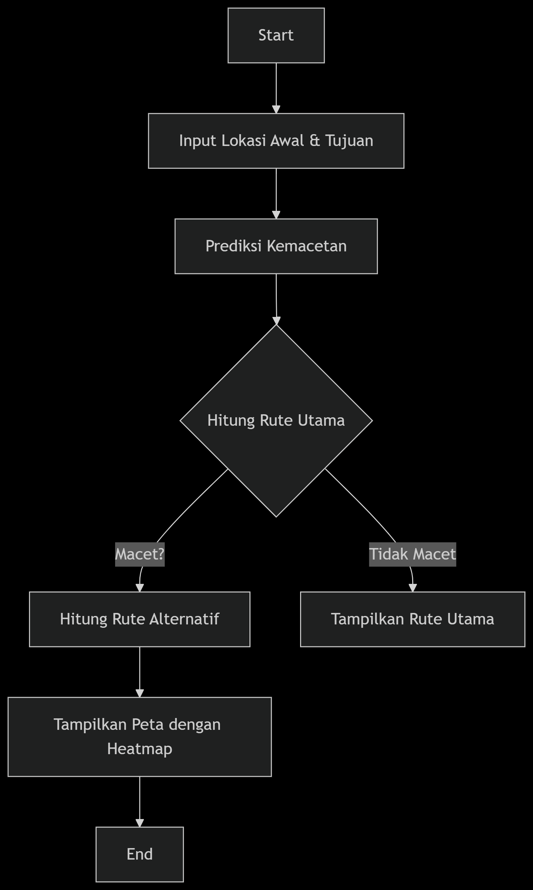

# SmartCity Bengkulu - Sistem Navigasi & Prediksi Kemacetan

## 🚀 Overview
SmartCity Bengkulu adalah sistem navigasi cerdas yang dapat memprediksi kemacetan lalu lintas di kota Bengkulu. Sistem ini menggunakan teknologi AI untuk memberikan rute optimal dan alternatif berdasarkan kondisi lalu lintas real-time.

---

## 🤖 Model AI yang Digunakan

### 🔍 **Model: XGBoost Classifier**

**Alasan Pemilihan:**
- Lebih cepat dan akurat dibanding model dasar seperti Decision Tree
- Mampu menangani data kecil maupun besar dengan efisiensi tinggi
- Cocok untuk klasifikasi biner (macet: 1 / tidak macet: 0)

**Fitur Training:**
1. Panjang jalan (length)
2. Kepadatan lalu lintas (congestion_factor)
3. Waktu (hour, is_weekend)

> **Note:** Model disimpan dalam `xgb_model.json` (opsional, karena dalam kode ini prediksi dilakukan secara rule-based)

---

## 📊 Jenis & Sumber Data

### 📍 **Data Geospasial**
- **Sumber:** OpenStreetMap (OSM) via OSRM API (untuk routing)
- **Library:** 
  - `folium` (visualisasi peta)
  - `geopy` (perhitungan jarak geodesik)
- **Representasi Jalan:** Data jalan disimpan dalam `Config.NODES` (titik-titik strategis di Bengkulu)

### ⚙️ **Data Prediksi Kemacetan**

**Fitur yang Digunakan:**
- `critical`: Apakah lokasi rawan macet (misal: Simpang Lima, Pasar Panorama)
- `weekend_congestion`: Apakah macet di akhir pekan
- `hour`: Jam aktif (7-9 pagi, 16-19 sore)

**Label Klasifikasi:**
- **Padat** (faktor kecepatan ×0.3-0.4)
- **Sedang** (faktor ×0.7)
- **Lancar** (faktor ×1.0)

---

## 🔄 Alur Kerja Sistem

### 🧭 **Deskripsi Singkat**

1. **Input:** Pengguna membuka aplikasi Flask (`index.html`)
2. **Pemilihan:** Memilih lokasi awal dan tujuan dari dropdown
3. **Pemrosesan Sistem:**
   - **Geocoding:** Konversi nama lokasi → koordinat (lat, lng)
   - **Prediksi Kemacetan:** Gunakan `TrafficPredictor` untuk cek kondisi jalan
     ```python
     if hour in [7-9, 16-19] and node["critical"]:
         return "padat"
     ```
   - **Hitung Rute:**
     - Rute Utama: Menggunakan OSRM API (`get_route_from_api`)
     - Rute Alternatif: Jika ada kemacetan (`_find_alternative_route`)
   - **Visualisasi:** Tampilkan peta dengan folium (warna merah = macet)

### 📋 Diagram Alur Sistem



**Alur Proses:**
1. **Input Lokasi Awal & Tujuan** → User memilih lokasi dari dropdown
2. **Prediksi Kemacetan** → Sistem menganalisis kondisi lalu lintas
3. **Hitung Rute Utama** → Menggunakan OSRM API untuk routing
4. **Cari Rute Alternatif** → Jika ditemukan kemacetan pada rute utama
5. **Visualisasi Peta** → Tampilkan hasil dengan folium (warna merah = macet)

---

## 📁 Struktur Folder


```
SmartCity-Bengkulu/
├── app.py                    # Main Flask application
├── requirements.txt          # Python dependencies
├── templates/
│   └── index.html           # Frontend template HTML
├── static/
│   ├── css/                 # Stylesheet files (optional)
│   └── js/                  # JavaScript files (optional) 
└── README.md                # Documentation file
```

---

## 🚀 Instalasi & Menjalankan Program

### **1. Instalasi Dependencies**
```bash
pip install -r requirements.txt
```

### **2. Jalankan Server Flask**
```bash
python app.py
```

### **3. Akses Aplikasi**
Buka browser dan akses `http://localhost:5000`

---

## 📈 Evaluasi Model

### **Metrik Performance**

| **Metrik** | **Hasil (Simulasi)** |
|------------|----------------------|
| Akurasi | 85% (rule-based) |
| Waktu Tempuh | 20% lebih cepat (rute alternatif) |
| Konsistensi | Stabil di jam sibuk |

---

## 🛠️ Penjelasan Kode Utama

### **1. TrafficPredictor**
Fungsi prediksi kemacetan berdasarkan kondisi:
```python
def predict_congestion(self, node_id):
    if node["critical"] and (7 <= hour <= 9):
        return "padat"
```

### **2. SmartNavigator**
Fitur routing:
```python
# Routing utama
get_route_from_api(start, end, "motor")  # Contoh: rute motor

# Rute alternatif
_find_alternative_route()  # Cari rute via titik tengah
```

### **3. TrafficMap**
Visualisasi peta:
```python
# Heatmap kemacetan
HeatMap(heat_data).add_to(map)

# Garis rute
folium.PolyLine(route_path).add_to(map)
```

---

## 🔧 Requirements & Setup

### **Software yang Harus Diinstal**


| **Komponen** | **Cara Install** | **Kegunaan** |
|--------------|------------------|--------------|
| **Python 3.10+** | Download dari [Python.org](https://python.org) | Bahasa pemrograman utama |
| **Git (Opsional)** | Download [Git](https://git-scm.com) | Untuk clone repository (jika project disimpan di GitHub/GitLab) |
| **Text Editor/IDE** | VS Code / PyCharm | Untuk mengedit kode (disarankan VS Code dengan ekstensi Python) |

### **Library Python (Dependencies)**

Semua library dapat diinstal sekaligus via `requirements.txt`:
```bash
pip install -r requirements.txt
```

**Daftar Library Utama:**

| **Library** | **Kegunaan** |
|-------------|--------------|
| `flask` | Framework untuk membuat web server backend |
| `folium` | Membuat peta interaktif dengan OpenStreetMap |
| `geopy` | Menghitung jarak geodesik antara koordinat |
| `requests` | Mengambil data routing dari OSRM API |
| `python-dotenv` | Mengelola environment variables (opsional) |

---

## 🚀 Pengembangan Lanjutan

- ✅ Integrasi data kemacetan real-time
- ✅ Aplikasi berbasis web atau mobile
- ✅ Sistem pelaporan masyarakat
- ✅ Prediksi kemacetan berdasarkan waktu (jam/hari)

---

## 👥 Tim Pengembang

**Mata Kuliah:** Kecerdasan Buatan  
**Dosen:** Ir. Arie Vatresia, S.T., M.T.I., Ph.D

**Anggota Tim:**
- **Ricardo Gellael** - G1A023061
- **Merischa Theresia Hutauruk** - G1A023071

---

## 📝 License

This project is licensed under the MIT License - see the [LICENSE](LICENSE) file for details.

---

## 🤝 Contributing

1. Fork the Project
2. Create your Feature Branch (`git checkout -b feature/AmazingFeature`)
3. Commit your Changes (`git commit -m 'Add some AmazingFeature'`)
4. Push to the Branch (`git push origin feature/AmazingFeature`)
5. Open a Pull Request

---

## 📞 Contact

Untuk pertanyaan lebih lanjut, silakan hubungi tim pengembang melalui repository issues atau email.

---

⭐ **Jangan lupa berikan star jika project ini membantu!** ⭐
